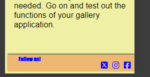

# Cat Photography Tips Website

the responsive image is from [am i responsive?](https://ui.dev/amiresponsive?url=https://johannesabresparr.github.io/cat-photo/)

## Intro
The Cat Photography Tips Website is intended to guide people who wants to take better photos of their cats or pets in some very basic photography steps. A small "how to" site just to get them started in expolring the world of pet photography.

## Features User Experience
#### How I intended and how it turned out

__Index / Homepage__

 

On the index-page I wanted the User to get some basic photographic tips. I wrote all of the text myself. I also added a link to wikipedia explaining the rule of thirds. Hopefully this will improve the quality of photos for the User, as well as ignite a spark of quriosity regaring the wide world of photography.

__Gallery page__

 

On the gallery page I added some of my own photos as examples for the User to explain more in detail how the photos were taken, thus giving the User a larger understanding for and some more tips on how to take good pictures of their pets.

__Contact page__

On the contact page, the User finds my email and my phonenumber.
They may also subscribe to a weekly email with commersial material.
As the User surely have further questions and a newborn passion for photography, they will be eager to recieve emails with relevant links.
I also assure them their personal data is safe with me.

### Existing Features

- __Navigation Bar__

- Featured on all three pages, the full responsive navigation bar includes links to the Home page, Gallery and Contact page and is identical in each page to allow for easy navigation.

- When the screen size is and is smaller than 768px the navbar turns into an bar-icon to save space in the header.

- This section will allow the user to easily navigate from page to page across all devices without having to revert back to the previous page via the "back" button. 
  
 - __Logotype__

- The logo-name in the header is clickable on every page so whenever clicked it returns to the home-page.

- __The Footer__ 

- As you notice when you scroll down the pages, the header is always present with its links.
The footer is not showing until one has scrolled to the very bottom of the page, this to save some screen-space and avoid distraction.
Whitin the footer element the User finds social media links so they can follow my other channels for even more valuable tips.

### Features Left to Implement

- In the future I would have added a video-page with photography tutorials.
- Also a merchandise-page to sell high quality photo equipment to the user. 

## Testing 

I have used Dev-tools in Google Chrome to check how the pages respond to diffrent sizes.
For example I have done a lot of testing to get the gallery-page to work good. 
I also wanted the navigation bar to become an burger-menu for the smaller screen-sizes.
Here we see that the buger nav-toggle is missing, We also see there being three columns of photos, at these smaller sizes I want them to be only two, and on 768px and smaller I want only one column.

I was finally able to solve this by changeing the order of the media-querries from biggest to smallest screen-size within the stylesheet.

The Webpage is responsive on all web-browsers i have tested it in, even the subscription-form on the contact page is working properly. Microsoft Edge, Firefox, Oprah and Chrome. 

In this section, you need to convince the assessor that you have conducted enough testing to legitimately believe that the site works well. Essentially, in this part you will want to go over all of your project’s features and ensure that they all work as intended, with the project providing an easy and straightforward way for the users to achieve their goals.

In addition, you should mention in this section how your project looks and works on different browsers and screen sizes.

You should also mention in this section any interesting bugs or problems you discovered during your testing, even if you haven't addressed them yet.

If this section grows too long, you may want to split it off into a separate file and link to it from here.

### Validator Testing 

- No contrast-errors were found on testing the website on [Wave.webaim.org](https://wave.webaim.org/) 

- HTML
  - No errors were returned when passing through the official [W3C validator](https://validator.w3.org/nu/?doc=https%3A%2F%2Fcode-institute-org.github.io%2Flove-running-2.0%2Findex.html)
- CSS
  - No errors were found when passing through the official [(Jigsaw) validator](https://jigsaw.w3.org/css-validator/validator?uri=https%3A%2F%2Fvalidator.w3.org%2Fnu%2F%3Fdoc%3Dhttps%253A%252F%252Fcode-institute-org.github.io%252Flove-running-2.0%252Findex.html&profile=css3svg&usermedium=all&warning=1&vextwarning=&lang=en#css)

### Unfixed Bugs

You will need to mention unfixed bugs and why they were not fixed. This section should include shortcomings of the frameworks or technologies used. Although time can be a big variable to consider, paucity of time and difficulty understanding implementation is not a valid reason to leave bugs unfixed. 

## Deployment

This section should describe the process you went through to deploy the project to a hosting platform (e.g. GitHub) 

- The site was deployed to GitHub pages. The steps to deploy are as follows: 
  - In the GitHub repository, navigate to the Settings tab 
  - From the source section drop-down menu, select the Master Branch
  - Once the master branch has been selected, the page will be automatically refreshed with a detailed ribbon display to indicate the successful deployment. 

The live link can be found here - https://code-institute-org.github.io/love-running-2.0/index.html 

## Credits 

 

- I got the idea for the nav bar toggle- icon on smaller screens from the Code Institute walkthrough by AJ Greaves, explained so well by Jo Heyndels. I have used much of the class- and id- names from the walkthrough since they were the most fitting in the code, but I have styled it diffrently. 

-The transition- attribute where the navigation- social media- and other -links "slowly" change color while hovered I stumbled upon watching this youtube channel [@WebDevSimplified.](https://www.youtube.com/@WebDevSimplified) and more exact this video: [Animated burger menu how to](https://www.youtube.com/watch?v=dAIVbLrAb_U&t=787s)

The idea on how I would make the header stick to the top but make the footer scroll up with the content within the body (this to save valuable space and reduce distraction on especially small screens ) came from this Youtube channel: [The Code Creative](https://www.youtube.com/@TheCodeCreative)  and more exactly this video: [Footer tutorial](https://www.youtube.com/watch?v=ffb34dCmMVQ)

-I have used the Code institute template [The Code Institute Responsive Formdump](https://formdump.codeinstitute.net/) whitin my subscription-form on my contact page.

- I started out making divs with paragraphs, but searched om google an found this page which gave me some tips on how to set up the gallery useing <figure> and <figurecaption>.
Medium.com
[medium.com where I found figure and figcaption](https://medium.com/frontendshortcut/how-to-make-a-polaroid-photo-gallery-in-html-and-css-d68f5a306c84)

### Content 
-The text throught the entire website on all pages, are my own. Both the tips and the photo captions on the gallery page.

-I have linked [Wikipedia rule of thirds](https://en.wikipedia.org/wiki/Rule_of_thirds) for the users to find a broader explenation of the "rule of thirds".

- The icons in the header and footer were taken from [Font Awesome](https://fontawesome.com/)

### Media

-The photos used are all my own, taken by me; Johannes Abresparr.

### THANK YOU SO MUCH!

Akshat Garg, my mentor, for believeng in me and give me some valuable tips on where to look for information.

Dajana Isbaner for "turning" my brain in the right direction according to the order of the media-queries!

Kristyna, Cohort fasilitator at Code Institue for checking in how I was doing.

And a big thanks to my fellow codewriteing friends in "my group" feb-2024-dfs-gut whom has given me some valuable input and ideas!

Also a big thank you to my wonderful wife Lea for being there!

And of course, a gigantic thank you to our four furry family members; Vilja, Vilde, Aslan and Leo, for not deleting my code as you walked over my keyboard... 

J. Abresparr 2024
